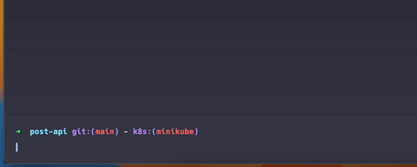

# Q
Kubectl query plugin, `q` queries the namespace for a pod and prompts the user for selection, after which it will forward the selected pod to a provided kubectl command. Some commands are handled directly by `q` and require further input from the user, simpler use cases should be handled by the `custom` command.



## Installation
This plugin is not yet available in the krew index, but can be installed directly from the repository (go1.20 required).

```bash
# edit makefile to set the correct plugin path
make build
```

## Usage
```bash
kubectl q [command] [flags]
```

## Commands
### custom
```bash
kubectl q custom [flags] -- [command + args + optional(replacement string)]
```
This command will prompt the user for a pod and then forward the selected pod to the provided command. The command must be provided after the `--` flag as the first argument. The pod name will replace every instance of the string `%%` in the command.
```bash
# Describe the selected pod
kubectl q custom -- describe pod # -> kubectl describe pod <pod>

# Follow the logs of the selected pod (custom is the default command)
kubectl q -- logs -f # -> kubectl logs -f <pod>
```

```bash
# Execute a custom command on the selected pod (tty not supported)
kubectl q -- exec %% -- ls # -> kubectl exec <pod> -- ls
```

### port-forward
```bash
kubectl q port-forward [flags] -- [args]
```
This command will prompt the user for a pod and then forward the selected ports using the kubectl port-forward command. 
```bash
kubectl q port-forward
```
